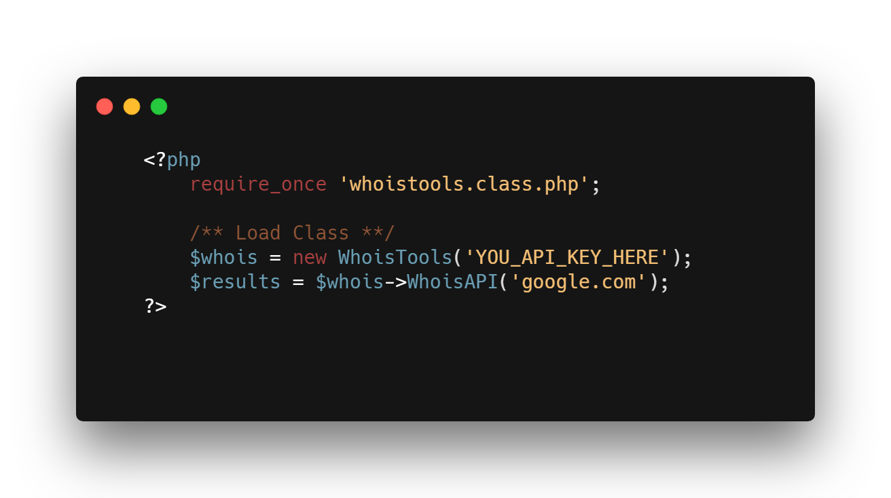

# WhoisTools PHP Library
PHP library to query WhoisTools API service.

WhoisTools Menggunakan Sistem RestFull API dengan result JSON. Untuk Authentikasi akun, bisa dengan API Key yang dapat anda lihat di <a href='//whoistools.web.id/dashboard'>dashboard area</a>.

Jika belum mempunyai akun, bisa daftar di https://whoistools.web.id/dashboard/register

## How To
Anda dapat memanggil file <code>whoistools.class.php</code> pada code anda, dan lakukan pemanggilan perintah dengan cara :

Untuk Contoh yang lebih lengkap bisa anda lihat file di atas, atau kunjungi https://whoistools.web.id/docs/

## Troubleshoot
Jika anda mendapatkan problem dalam menjalankan library, hubungi whoistools@dev.mexious.com

## License
PHP Library ini menggunakan lisensi GNU General Public License v2 (or later)

